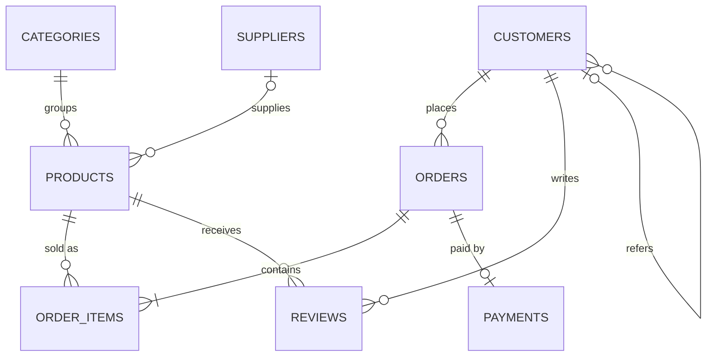

# SQL E-commerce Report

A relational database and analytics report for a small online store, built in MySQL as the Week 4 SQL project.
It covers **50 queries** across top products, customer spend, NULL handling, JOINs and DDL constraints.

## Highlights

- 8-table normalised schema with PK, FK (`CASCADE` / `RESTRICT` / `SET NULL`), `UNIQUE`, `NOT NULL`, `DEFAULT`, `CHECK` and `ENUM`
- Seed data with deliberate edge cases (NULL phones, NULL suppliers, customers who never ordered, cancelled and returned orders)
- 50 analytical queries: aggregations, all JOIN types, subqueries, CTEs and window functions
- A dedicated NULL-handling section, including the `NOT IN` + `NULL` trap
- A constraint-violation lab showing the exact error each constraint raises

## Tech stack

MySQL 8.0.16 or later (needed for enforced `CHECK` constraints, CTEs and window functions). Works in MySQL Workbench, DBeaver or the `mysql` CLI.

## Project structure

```
sql-ecommerce-report/
├── 01_schema.sql                 # database, tables, constraints, indexes, view
├── 02_seed_data.sql              # sample data for every table
├── 03_queries.sql                # 50 analytical queries (Q1 - Q50)
├── 04_ddl_constraints_demo.sql   # constraint tests + ALTER / INDEX / DROP demos
└── README.md
```

## How to run

```bash
mysql -u root -p < 01_schema.sql
mysql -u root -p < 02_seed_data.sql
mysql -u root -p < 03_queries.sql          # or run queries one at a time in Workbench
mysql -u root -p < 04_ddl_constraints_demo.sql
```

Run the files in order. `01_schema.sql` drops and recreates `ecommerce_db`, so it resets everything.

## Entity-relationship diagram



## Schema overview

| Table | Purpose | Key constraints |
|---|---|---|
| `customers` | Shopper profiles, referral link | `UNIQUE(email)`, `CHECK` email and 10-digit phone, self-FK `referred_by` (`SET NULL`) |
| `categories` | Product groups | `UNIQUE(category_name)` |
| `suppliers` | Vendors | `UNIQUE(contact_email)`, `DEFAULT 'India'` |
| `products` | Catalogue | `CHECK price > 0`, `cost >= 0`, `cost <= price`, `stock_qty >= 0`; FK category (`RESTRICT`), FK supplier (`SET NULL`) |
| `orders` | Order header | `ENUM` status, `CHECK discount_pct BETWEEN 0 AND 50`, FK customer (`RESTRICT`) |
| `order_items` | Order lines (junction) | `UNIQUE(order_id, product_id)`, `CHECK quantity > 0`, FK order (`CASCADE`) |
| `payments` | One payment per order | `UNIQUE(order_id)`, `ENUM` method and status, nullable `payment_date` |
| `reviews` | Product ratings | `CHECK rating BETWEEN 1 AND 5`, `UNIQUE(product_id, customer_id)` |

The view `v_order_summary` gives gross and net (post-discount) value per order and is reused by most revenue queries.

## Business rules used in the queries

- **Valid sales** are orders with status `Shipped` or `Delivered`. Cancelled, Returned and Pending orders are excluded from revenue.
- **Net revenue** = `SUM(quantity * unit_price) * (1 - discount_pct / 100)`.
- `unit_price` on `order_items` is frozen at purchase time, so later price changes do not rewrite history.

## Query index

| Section | Queries | Concepts |
|---|---|---|
| Basic SELECT | Q1 - Q5 | `WHERE`, `IN`, `BETWEEN`, `LIKE`, `DISTINCT`, `LIMIT` |
| NULL handling | Q6 - Q13 | `IS NULL`, `COALESCE`, `IFNULL`, `NULLIF`, `COUNT(*)` vs `COUNT(col)`, `NOT IN` trap vs `NOT EXISTS`, `CASE` |
| Aggregation | Q14 - Q21 | `SUM`, `AVG`, `GROUP BY`, `HAVING`, monthly trend, cancellation rate |
| JOINs | Q22 - Q30 | `INNER`, `LEFT` (anti-joins), self join, multi-table join, market basket, full outer join emulation |
| Top products | Q31 - Q36 | top-N by revenue and units, `RANK()` per category, profit per product, ratings |
| Customer spend | Q37 - Q43 | top customers, zero-order customers, above-average spend, segmentation, `DENSE_RANK()`, lifetime value CTE |
| Time and geography | Q44 - Q46 | running total, month-over-month growth with `LAG`, revenue by state |
| Subqueries and checks | Q47 - Q50 | `IN`, conditional anti-join, low-stock alerts, relational division |

## Constraint lab (`04_ddl_constraints_demo.sql`)

Part A has 12 statements that are meant to fail, each with the expected MySQL error code (1062 duplicate key, 1452 and 1451 foreign key, 3819 check violation, and so on). Part B demonstrates `ALTER TABLE` (add and modify columns, add and drop constraints), `CREATE INDEX` with `EXPLAIN`, `information_schema` lookups and `TRUNCATE` vs `DELETE`.

## Key learnings

1. `= NULL` never matches anything; use `IS NULL`.
2. `NOT IN` with a NULL in the subquery silently returns nothing, so prefer `NOT EXISTS`.
3. A condition in the `ON` clause of a `LEFT JOIN` behaves differently from the same condition in `WHERE`.
4. Window functions sit on top of `GROUP BY` results, so aggregate first and rank second.
5. Constraints in the schema catch bad data at the source, which is cheaper than cleaning it later.

## Possible extensions

- Triggers that reduce `stock_qty` when an order item is inserted
- Stored procedure for monthly sales reports
- Partitioning `orders` by year
- A dashboard in Power BI or Tableau on top of the views

## Author

Maheedhar, Final-year CSE (B.E.), NMIT Bengaluru.
