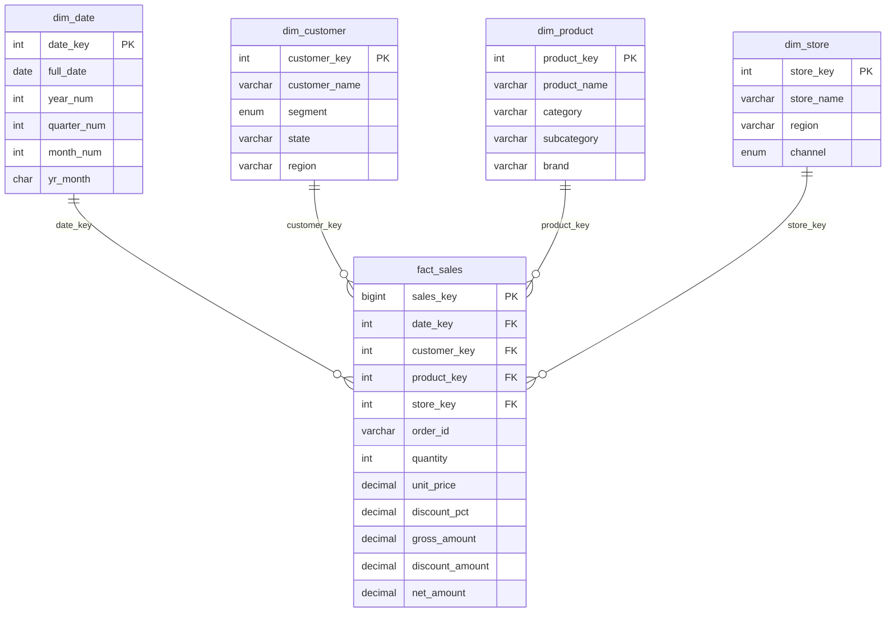

# 05 · SQL Dimensional Report (SQL — Week 5)

A mini data-warehouse project on **MySQL 8.0+** covering:

| Topic | File |
|---|---|
| Star schema (1 fact + 4 dimensions) | `01_schema.sql` |
| Sample data (5,000 sales rows, Jan 2025 – Sep 2026) | `02_seed_data.sql` |
| Window-function rankings | `03_window_rankings.sql` |
| CTE-based Month-over-Month report | `04_cte_mom_report.sql` |
| `ROLLUP` subtotals / grand totals | `05_rollup.sql` |
| `EXPLAIN` optimization | `06_explain_optimization.sql` |
| Run everything in order | `run_all.sql` |

All scripts were tested on MySQL 8.0 and run without errors.

## Star schema



**Grain of the fact table:** one product line on one order.
**Measures:** `quantity`, `gross_amount`, `discount_amount`, `net_amount`.
**Design choices:** integer surrogate keys, `date_key` as `YYYYMMDD`, `order_id` kept as a degenerate dimension, descriptive attributes denormalised into dimensions.

> Note: the month label column is `yr_month` (not `year_month`) because `YEAR_MONTH` is a reserved word in MySQL.

## How to run

```bash
# Option A: everything at once (from inside this folder)
mysql -u root -p < run_all.sql

# Option B: step by step
mysql -u root -p < 01_schema.sql
mysql -u root -p < 02_seed_data.sql
mysql -u root -p < 03_window_rankings.sql     # etc.
```

MySQL Workbench / DBeaver: open each file and run it in order (01 → 06).

## What each script demonstrates

**03 · Window functions**
`RANK`, `DENSE_RANK`, `ROW_NUMBER`, `NTILE`, `PARTITION BY` (top-N per group), `SUM() OVER` running totals, moving averages with `ROWS BETWEEN`, `LAG`/`LEAD`, named `WINDOW` clauses.

**04 · CTE MoM report**
Chained CTEs → `LAG()` → MoM change and %, UP/DOWN trend flag, MoM by category (`PARTITION BY`), YoY using `LAG(x, 12)`, best/worst growth months.

**05 · ROLLUP**
`GROUP BY ... WITH ROLLUP` for Year > Quarter > Category, Region > State, Channel > Store. `GROUPING()` tells subtotal NULLs apart from real NULLs and is used for readable labels and for ordering totals last.

**06 · EXPLAIN optimization**
| Step | Lesson |
|---|---|
| 1 vs 2 | `YEAR(col)=…` is non-sargable; a range predicate (`col >= … AND col < …`) can use the index |
| 3 | Filtering on an unindexed column gives `type = ALL` (full scan); after `CREATE INDEX` it becomes `type = ref` |
| 4 | Covering composite index → `Using index` (no table lookups) |
| 5 | `EXPLAIN ANALYZE` and `FORMAT=TREE` show real timings and row counts |
| 6 | Pre-aggregated summary table for dashboards |

How to read `EXPLAIN`: check **type** (`ALL` is worst; `ref`/`range`/`eq_ref`/`const` are better), **key** (index actually used), **rows** (estimated rows examined) and **Extra** (`Using index` is good; `Using temporary` / `Using filesort` are cost signals).

## Expected results (sanity checks)

- Row counts: `dim_date` 638, `dim_customer` 20, `dim_product` 12, `dim_store` 5, `fact_sales` 5,000.
- Top product by revenue: **Standing Desk**, followed by **Ergonomic Office Chair**.
- The ROLLUP grand total equals `SELECT SUM(net_amount) FROM fact_sales`.
- First month in the MoM report (2025-01) has `NULL` growth because there is no previous month.

## Porting to PostgreSQL

- `WITH ROLLUP` → `GROUP BY ROLLUP(a, b)`
- `DATE_FORMAT`, `DAYNAME`, `MONTHNAME` → `TO_CHAR`
- `AUTO_INCREMENT` → `GENERATED ALWAYS AS IDENTITY`
- `ENUM` → `CHECK` constraint or a custom type
- `EXPLAIN ANALYZE` works the same way

## Ideas to extend

1. Add a `dim_date` fiscal calendar and holiday flag.
2. Make `dim_customer` a Type-2 slowly changing dimension (`valid_from`, `valid_to`, `is_current`).
3. Build a cohort or retention report with window functions.
4. Wrap Report 1 in a view (`CREATE VIEW v_mom_report`) for BI tools.
